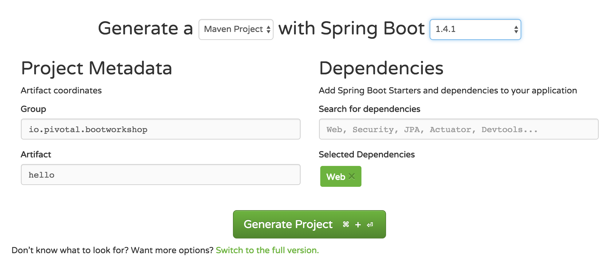

# Spring Boot Basics

## run locally
1. visit [Spring Initializer](http://start.spring.io)

2. configure your project
   * group name (change to `io.pivotal`)
   * artifact name (`hello` is recommended)
   * *_maven_* for your build system
   * spring boot version 1.5.3
3. add dependencies
   * Web
4. select 'Generate Project'
5. unzip the downloaded file
6. open in IDE
7. open `pom.xml` - notice the spring starters
8. create class: `HelloController` in same directory as the Boot app class
   * annotate the class with `@RestController` (package: `org.springframework.web.bind.annotation`)
   * create method: `public String sayHello() { return "Hello Carfax"; }`
   * annotate the method with: `@RequestMapping("/")` (package: `org.springframework.web.bind.annotation`)
   * your source should look something like this:
```java
package io.pivotal.hello;

import org.springframework.web.bind.annotation.RequestMapping;
import org.springframework.web.bind.annotation.RestController;

/**
 * Created by phopper on 05/23/17.
 */
@RestController
public class HelloController {

    @RequestMapping("/")
    public String sayHello(){
        return "Hello Carfax!";
    }

}
```


9. from project root directory, run `mvn spring-boot:run`
10. point a web browser to http://localhost:8080
11. bask in the glory that is Spring Boot

## push to Pivotal Cloud Foundry
1. make sure you have all of your [prerequisites](https://github.com/phopper-pivotal/PCF-Workshop-Carfax/#pre-requisites) in place.
2. build a runnable jar `./mvnw package`
3. log in to cloud foundry `cf login -a api.system.pcf-apps.net`
4. when prompted, provide your email and password
5. if prompted, choose an appropriate org and space
6. push your app:  `cf push hello -p ./target/hello-0.0.1-SNAPSHOT.jar -n "hello-paul" -b java_buildpack_offline`
   * instead of 'hello-paul' give your app a unique route (the `-n` option)
   * depending on what you called your app, the runnable jar (the `-p` option) may be different
   * watch the output, it will tell you the url of your app
```
Creating app hello in org phopper / space dev as phopper@pivotal.io...
OK

Creating route hello-paul.cfapps.io...
OK

Binding hello-paul.cfapps.io to hello...
OK
```
7. open a web browser to the route of your app - from the output of the `cf push`
8. celebrate
9. let's create a `manifest.yml` at the top level of your project
```yml
---
applications:
- name: hello
  buildpack: java_buildpack_offline
  host: hello-${random-word}
  path: target/hello-0.0.1-SNAPSHOT.jar
```
10. `cf push`
11. `cf apps` will show you all the deployed apps in your space along with their vital stats and mapped routes.  Notice the random words from the manifest file.
```
$ cf apps
Getting apps in org phopper / space dev as phopper@pivotal.io...
OK

name                  requested state   instances   memory   disk   urls
hello                 started           1/1         1G       1G     hello-unscaled-multimillion.cfapps.io
```
12. verify your app at its new randomly-generated route

# extra credit
1.  Why `@RestController`?
2. Allows you to return strings, but also enables some interesting features
3. Add this class to your HelloController.java file:
```java
class Greeting {
    private String message;
    private String greeting;
    private boolean happyToSeeYou;

    //constructor, getters, setters omitted for brevity

}
```
4.  and add this method:
```java
    @RequestMapping("/greeting")
    public Greeting greet() {
        return new Greeting("Hello", "Carfax", true);
    }
```
5. build a runnable jar `./mvnw package`
6. now `cf push` and visit http://hello-random-words.apps.pcf-apps.net/greeting
7. marvel at your newfound speed and productivity

[Course Materials home](../../README.md#labs)

[Lab 5 - Monitoring Applications](../lab05_spring_actuator/README.md)
